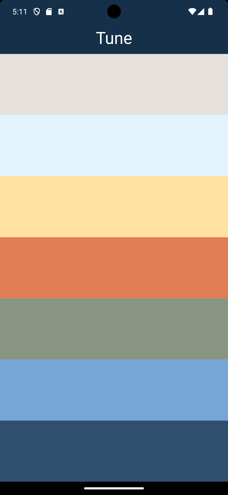

# Tune App

**Tune** is a simple Flutter application that allows users to play different musical notes by tapping on color-coded buttons. Each button represents a different sound, providing an interactive way to explore various musical tones.

## Features

- **Color-coded buttons**: Each button is associated with a unique color, making it easy to distinguish between different sounds.
- **Tap to play**: Users can tap on any button to play the corresponding musical note.
- **Clean UI**: The app has a straightforward and clean user interface with a centered title and neatly organized buttons.

## Screenshots

### Home Screen



*The main screen displaying all the color-coded buttons for playing different musical notes.*

## Technical Details

- **Programming Language**: Dart
- **Framework**: Flutter
- **Packages Used**: 
  - `audioplayers` for audio playback

## Code Overview

### `main.dart`
The entry point of the app, setting up the `MaterialApp` and `TunePage`.

```dart
import 'package:flutter/material.dart';
import 'package:tune/screens/tune_page.dart';

void main() {
  runApp(const Tune());
}

class Tune extends StatelessWidget {
  const Tune({super.key});

  @override
  Widget build(BuildContext context) {
    return const MaterialApp(
      debugShowCheckedModeBanner: false,
      home: TunePage(),
    );
  }
}
